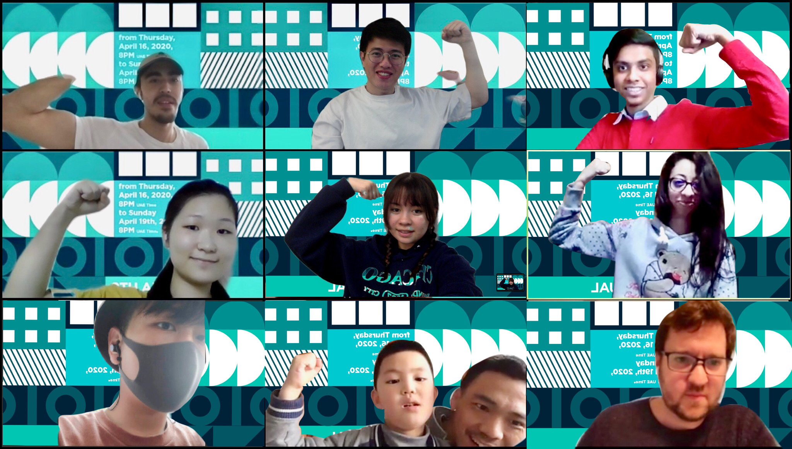
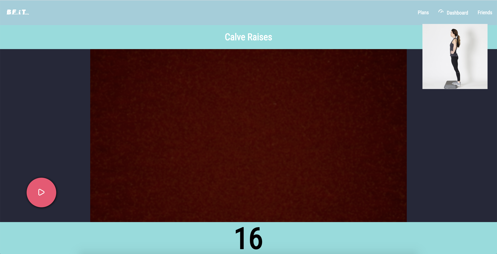

# BFiT

During these rough pandemic times, we are forced to stay in quarantine at our homes. This causes minimal movement activity which isn't great for our health. It is very important to stay fit but it is difficult to get the motivation. **BFiT** for _Be Focused in Training_ is a social web app that allows users to workout and have training sessions with their family, friends, or anyone who wants to stay fit and healthy. BFiT is your very own personal trainer with planned training sessions catered towards your personal needs!

## Team Members

Due to the combined efforts of our team members, BFiT secured the **3rd** place in the hackathon!

### Students:

*	[Mohammed Shoaib](https://github.com/Mohammed-Shoaib) (Birla Institute Of Technology and Science, UAE, shoaib98libra@gmail.com)
*	[Julia Itani](https://github.com/Jules97) (Islamic University of Lebanon, Lebanon, julia97itani@gmail.com)
*	[Steven Wyks](https://github.com/slw515) (New York University Abu Dhabi, UAE, slw515@nyu.edu)
*	[Oona Pecson](https://github.com/piinkoon) (NYU Shanghai, USA, op531@nyu.edu)
*	[Haoquan Wang](https://github.com/KENNETH233) (NYU Shanghai, China, hw1882@nyu.edu)
*	[Yu Yan](https://github.com/Sonnyyy77) (NYU Shanghai, China, yy2627@nyu.edu)

### Mentors:

*	[Poseidon Ho](https://github.com/oi7) (Outliers Fund, USA, p@outliers.fund)
*	[Christian Grewell](https://github.com/clg236) (Professor, NYU Shanghai, China, christian@nyu.edu)
*	[Xu Li](https://github.com/xu-li) (Senior Applications Developer, NYU Shanghai, China, xu.li@nyu.edu)

### Screenshots:

